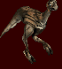
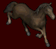

# Mount

With "Mounts" we refer to the NPCs that can be mounted by our character, within which we can distinguish many types that we will find categorized according to their method of obtaining in WILD SPECIES if it is the "ordinary" (=search and tame) or in OTHER OBTAINING METHODS if the procedure is different (=quest, champ, event...).

| **L**OYALTY                                                                                                                                                                                                                                                                                                                                                                                                                                                                                                                                                                                                                                                                          |
| ------------------------------------------------------------------------------------------------------------------------------------------------------------------------------------------------------------------------------------------------------------------------------------------------------------------------------------------------------------------------------------------------------------------------------------------------------------------------------------------------------------------------------------------------------------------------------------------------------------------------------------------------------------------------------------ |
| Some mounts, especially those used for PvM can be loyalized. To do this, the beast must be fed, for example, with an apple, and stored in a stable. The period of storage in the stable will not be less than one week (7 calendar days), and may take, for example, 10 days or two weeks. If after two weeks, the mount has not become loyal, then the step of feeding the beast was not done correctly and the process must be restarted. The staff does not intervene in this process, therefore, pages on loyal mounts will be removed from the system. Always keep in mind that these periods can be lengthened by external factors, such as service outages, world saves, etc. |

| ATTRIBUTES                                                                                                                                                                                                                                                                                                                                                                                                                                                                    |
| ----------------------------------------------------------------------------------------------------------------------------------------------------------------------------------------------------------------------------------------------------------------------------------------------------------------------------------------------------------------------------------------------------------------------------------------------------------------------------- |
| Mounts and in general all npcs can change their attributes, especially on reboots. This change can be for the better or worse, it is completely random. This is because mounts, when generated, can have different values ​​in their attributes (stats) and when the server restarts those values ​​are read again and assigned to some mounts for different reasons. This can also be noticed, for example, in summons or spells that turn the mage into some kind of beast. |

| SECURITY                                                                                                                                              |
| ----------------------------------------------------------------------------------------------------------------------------------------------------- |
| MOUNTS ARE ONLY SAFE IN THE STABLE OR WHILE A PLAYER IS MOUNTING THEM If the houses are used to house mounts, it is possible that they will disappear |

.gif>)    
